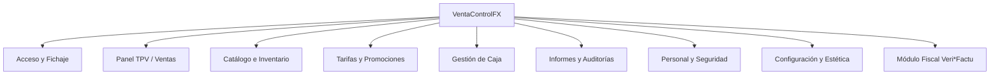

# Manual Operativo y de Configuración de VentaControlFX

Bienvenido al manual completo de **VentaControlFX**, un sistema de punto de venta (TPV) de alto rendimiento, modular, seguro y adaptado a la legislación fiscal española vigente (**Normativa Veri*Factu** de la AEAT).

Este documento detalla todas las funcionalidades, configuraciones y opciones operativas que ofrece la aplicación para optimizar la gestión comercial de tu negocio.

---

## 🗺️ Mapa de Módulos y Navegación

La aplicación se estructura en un menú lateral de navegación rápido (Sidebar) con acceso a los siguientes módulos clave:



---

## 1. 🔑 Acceso y Control de Presencia (Login)
**Módulo de autenticación y fichaje obligatorio para el personal.**

*   **Identificación Segura:** Inicio de sesión mediante usuario y contraseña con encriptación interna.
*   **Fichaje Automático de Turno:** Al iniciar sesión correctamente, el sistema registra en tiempo real el inicio de la jornada de ese empleado (fecha y hora exacta en milisegundos).
*   **Gestión de Recuperación:** Enlace directo para la solicitud de restablecimiento de contraseña ante pérdida.
*   **Control de Accesos:** Si el usuario no tiene permisos válidos asignados en su rol, el sistema bloquea preventivamente la entrada y notifica al administrador.

---

## 2. 📊 Panel Principal (Dashboard)
**El centro analítico y de resumen ejecutivo de la aplicación.**

*   **Métricas del Día:** Visualiza de un vistazo los indicadores más importantes del día comercial:
    *   Volumen de ventas brutas y netas.
    *   Número total de transacciones completadas.
    *   Indicador de nivel de stock crítico (alertas de reposición).
*   **Gráficos en Tiempo Real:** Representaciones visuales interactivas que muestran la distribución de ventas por categoría y la tendencia de facturación horaria.
*   **Acceso Directo:** Botones rápidos para funciones comunes (ej. aperturas de caja rápida).

---

## 3. 🛒 Terminal de Punto de Venta (TPV / Ventas)
**La interfaz central de atención al cliente y facturación rápida.**

*   **Grid de Productos Dinámico:** Los artículos se organizan visualmente mediante tarjetas. Permite la navegación veloz a través de un menú superior de categorías (Chips) y una barra de búsqueda inteligente por SKU o nombre.
*   **Panel del Carrito de Compra:**
    *   **Gestión de Líneas:** Modificación ágil de cantidades, cambio de precios unitarios o eliminación de líneas directamente en la rejilla.
    *   **Descuentos:** Permite aplicar descuentos porcentuales o fijos a nivel de artículo o sobre el total de la compra (sujeto a permisos de usuario).
    *   **Asociación de Cliente:** Enlaza el carrito a un cliente registrado para emitir facturas personalizadas o acumular puntos de fidelidad.
*   **Suspensión de Carritos (Aparcar Venta):** Permite pausar una venta en curso (ej. si el cliente olvida un artículo) para atender a otro cliente y recuperarla después sin perder los artículos.
*   **Módulo de Cobro Avanzado (Payment Dialog):**
    *   Soporte para múltiples métodos de pago: Efectivo, Tarjeta, Vales de Descuento y Pago Mixto.
    *   Calculadora de cambio integrada al introducir el efectivo entregado.
    *   Opción para emitir ticket simplificado o factura nominativa completa.
    *   Apertura automática del cajón portamonedas (ejecutada mediante relé de impresora).

---

## 4. 📦 Gestión de Catálogo e Inventario
**Administración integral de productos, stock y familias.**

*   **Control de Productos:** Tabla maestra para buscar, dar de alta, editar y dar de baja artículos.
    *   **Atributos Completos:** SKU/Código de barras, Nombre Comercial, Precio de Compra, Tarifa de Venta, Grupo de Impuesto aplicado (IVA, RE, Exento), e imagen del producto.
    *   **Gestión de Stock:** Parámetros de inventario mínimo para alertas de rotura de stock.
*   **Organización por Categorías:** Panel especializado para crear familias de artículos y asignar colores/iconos identificativos para el grid del TPV.

---

## 5. 🏷️ Tarifas y Promociones
**Motor dinámico para la fijación de precios y campañas de marketing.**

*   **Tarifas Múltiples (Price Lists):** Permite mantener distintos catálogos de precios simultáneamente (ej. *Tarifa General, Tarifa Mayorista, Tarifa VIP, Campaña de Rebajas*).
*   **Clonador Inteligente de Tarifas:** Herramienta para generar nuevas listas de precios a partir de una existente aplicando incrementos o descuentos porcentuales globales (ej. duplicar Tarifa General aplicando un +10% automáticamente).
*   **Motor de Promociones:** Configuración de ofertas complejas:
    *   Promociones de cantidad (ej. 2x1, 3x2).
    *   Descuentos porcentuales temporales por grupo de productos.
    *   Cupones de descuento interactivos con códigos de barras.
    *   **Toggles de Aplicación:** Opción de activar el modo automático (se aplica solo si el carrito cumple la condición) o manual (el cajero introduce un código promocional).

---

## 6. 💰 Gestión de Caja y Cierres (Cash Control)
**Módulo financiero para garantizar el cuadre exacto de la caja física.**

*   **Apertura de Caja:** Declaración obligatoria del fondo de efectivo inicial (cambio) para iniciar el turno de ventas.
*   **Transacciones Manuales (Entradas/Salidas de Efectivo):**
    *   **Ingresos extra:** Aportación de cambio adicional durante el turno.
    *   **Retiradas de efectivo:** Pagos a proveedores autorizados, retiradas a caja fuerte, etc.
    *   Ambas operaciones exigen especificar importe y motivo justificado.
*   **Cierre de Caja Ciego (Cash Closure):**
    *   El empleado introduce el arqueo real de monedas y billetes presentes en el cajón de manera independiente.
    *   El sistema compara el conteo real con el saldo esperado (Fondo Inicial + Ventas Efectivo + Entradas - Salidas) y detecta diferencias de caja (descuadre positivo o negativo).
*   **Auditoría de Cierres:** Historial permanente de cierres de caja detallados, accesibles únicamente para administradores, que desglosa las ventas por medio de pago e incidencias de descuadre.

---

## 7. 📈 Informes, Historial y Auditoría
**Herramientas analíticas avanzadas para la toma de decisiones y control de calidad.**

*   **Historial de Ventas Interactivo:** Buscador integral de facturas y tickets emitidos.
    *   Búsquedas por número de documento, fecha, cajero o cliente.
    *   Visualización interactiva de tickets en formato digital.
    *   **Módulo de Devoluciones:** Permite realizar devoluciones totales o parciales de líneas de venta de tickets anteriores, recalculando los impuestos asociados y emitiendo un ticket rectificativo.
*   **Informes de Clientes:** Reportes analíticos sobre consumo, volumen de compra y productos estrella de cada cliente con exportación estructurada.
*   **Auditoría de Puntualidad y Fichaje:** Historial de control de presencia de la plantilla. Desglosa retrasos, turnos trabajados, horas extra y asistencias.
*   **Reportes de Productividad de Vendedores:** Estadísticas de venta acumulada por empleado para control de incentivos y rendimiento comercial.

---

## 8. 👥 Personal, Seguridad y Roles
**Control exhaustivo sobre las credenciales y acciones del personal.**

*   **Administración de Personal:** Alta, baja, modificación de datos y restablecimiento de credenciales de los empleados del establecimiento.
*   **Gestión de Permisos Granulares:** Matriz de seguridad avanzada. Permite definir de forma específica qué opciones del software puede utilizar cada rol.
*   **Bypass de Permisos Personalizados:** Posibilidad de activar "Permisos a medida" para un empleado concreto, ignorando las reglas estándar de su rol para concederle o restringirle opciones de forma única (ej. un Cajero que tiene permiso para hacer devoluciones excepcionalmente).
*   **Control de Doble Turno:** Seguridad integrada para evitar que dos empleados fichen simultáneamente con la misma sesión sin cerrar el turno anterior.

---

## 9. 🎨 Configuración y Personalización Estética
**Adaptación técnica y visual de VentaControlFX al entorno corporativo.**

*   **Ajustes de Negocio (Sale Config):**
    *   Configuración de datos fiscales de la empresa (CIF, Dirección, Razón Social, Teléfono).
    *   Selección de moneda base, reglas de redondeo y formato decimal.
    *   Selección de impresoras predeterminadas para facturas y tickets.
*   **Configuración del Catálogo del IVA:** Registro dinámico de los tramos impositivos oficiales (ej. General 21%, Reducido 10%, Superreducido 4%, Recargo de Equivalencia).
*   **Panel de Personalización Visual (Estética en Vivo):**
    *   **Temas Estéticos:** Alternancia inmediata entre el **Modo Claro (Light Mode)** y el **Modo Oscuro (Dark Mode)** adaptando los contrastes para proteger la vista del cajero.
    *   **Paleta de Color Corporativo:** Permite seleccionar el color primario de los botones, barras de navegación e iconos mediante un selector interactivo. Los cambios estéticos se aplican al instante sin necesidad de reiniciar la aplicación.

---

## 10. 🇪🇸 Módulo Fiscal Inalterable (Normativa Veri*Factu)
**Módulo integrado de facturación certificada conforme a las directrices de la Agencia Tributaria Española (AEAT).**

```
[Venta/Devolución] ➔ [Cálculo de Control Hash] ➔ [Firma Digital Privada] ➔ [Encadenamiento con anterior] ➔ [Envío AEAT en 2º plano]
```

*   **Encadenamiento de Registros:** Cada factura o ticket que se emite genera un código hash único (`control_hash`) que se vincula obligatoriamente al hash de la factura anterior (`prev_hash`). Esto crea una cadena cronológica inalterable.
*   **Firma Digital Integrada:** Firma electrónica de cada registro fiscal utilizando el Certificado Digital (.pfx) de la empresa emisora.
*   **Generador de Códigos QR Fiscales:** Cada ticket o factura impresa contiene obligatoriamente la URL oficial de verificación de la AEAT y un código QR dinámico. El consumidor final puede escanearlo con su dispositivo móvil para verificar de forma inmediata que la factura ha sido declarada en los servidores de Hacienda.
*   **Dashboard de Control Veri\*Factu:** Panel de auditoría avanzada para el administrador:
    *   Monitor de envíos pendientes, aceptados o rechazados por la AEAT.
    *   Visor de mensajes XML de respuesta oficiales de Hacienda.
    *   Herramienta de reintento manual ante fallos de conexión a internet o saturación del servidor público.
    *   Garantía de envío asíncrono ordenado (Outbox Pattern) para no retrasar la atención al cliente durante la venta.

---

> 🛡️ **Nota de Seguridad:** Todas las operaciones de bases de datos, fichajes e incidencias en la caja se registran con marcas de tiempo en milisegundos (`gen_timestamp`) imposibles de manipular, garantizando la máxima transparencia ante auditorías externas o inspecciones fiscales de la AEAT.
